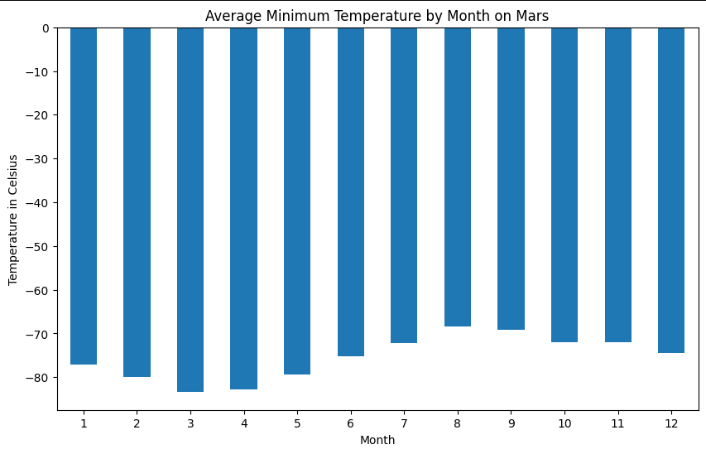
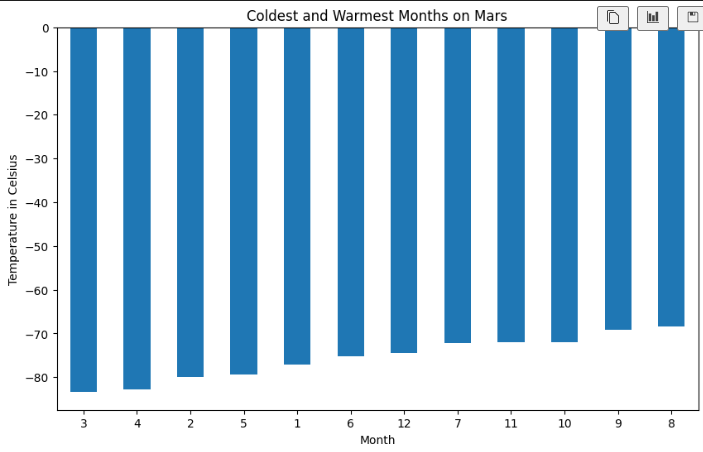
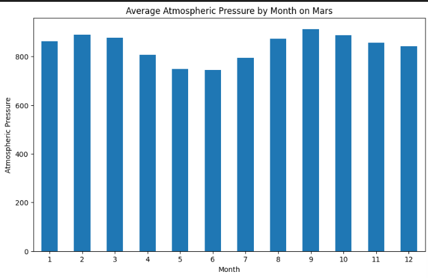
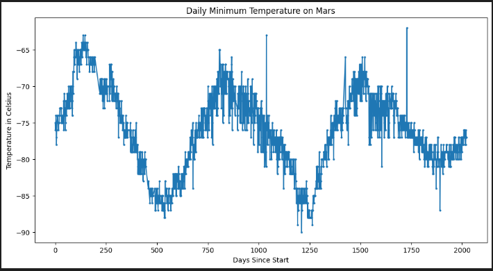

# Mars News and Weather Analysis

This project involves scraping Mars news articles and weather data, analyzing the data, and visualizing key metrics. The analysis is divided into two main parts:

1. Scraping titles and preview text from Mars news articles.
2. Scraping and analyzing Mars weather data.

## Mars News Scraping

The first part of the project involves scraping titles and preview text from Mars news articles. The data is stored in a JSON file for further analysis.
- [Mars News JSON](Mars_Outputs/mars_news.json)
- [Part 1: Mars News Scraping](Mars_News_and_Weather/part_1_mars_news.ipynb)

## Mars Weather Data Analysis

The second part involves scraping Mars weather data, analyzing it, and generating visualizations to summarize the findings.
- [Mars Weather Data CSV](Mars_Outputs/mars_weather_data.csv)
- [Part 2: Mars Weather Data Analysis](Mars_News_and_Weather/part_2_mars_weather.ipynb)

### Average Minimum Temperature by Month

### Coldest and Warmest Months

### Average Atmospheric Pressure by Month

### Daily Minimum Temperature on Mars

The daily minimum temperature plot helps in visually estimating the length of a Martian year in terrestrial days.

## Summary of Analysis

The analysis provides insights into the Martian weather patterns at the location of the Curiosity rover. Key findings include the identification of the coldest and warmest months, variations in atmospheric pressure, and a visual estimation of the Martian year's length. The data visualizations highlight these findings and provide a clear understanding of the Martian environment.

On average, the coldest minimum temperatures on Mars occur in the third month, while the eighth month is the warmest. However, it's important to note that Mars is extremely cold by human standards year-round!

Atmospheric pressure on Mars is generally at its lowest in the sixth month and reaches its peak in the ninth month.

The interval between temperature peaks is approximately 675 days, indicating that a Martian year is around 675 Earth days. This observation aligns with the fact that a Martian year is approximately 687 Earth days, as confirmed by external sources.
